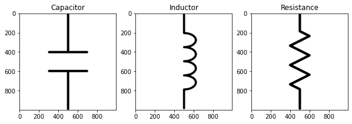
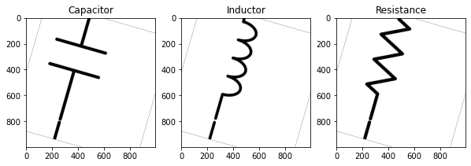
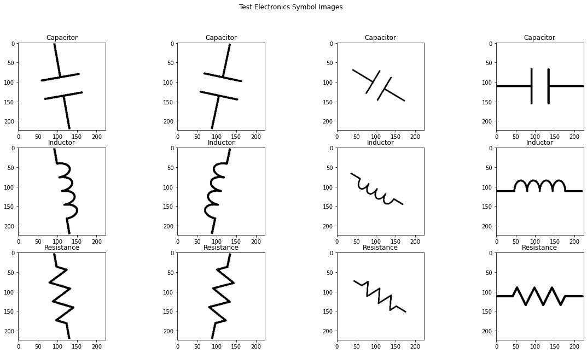

## Introduction


In this lab, you will build and train a CNN model to classify electronic symbols. The dataset available was created a long time ago (2015), back then this problem was sort out using classic ANN, but it was necessary to extract some features like rotation angle, rescale image, using OpènCV in order to achieve a better performance.
<br> This time the idea is create a CNN model that could automatically extract features from the dataset to make it not sensible of noise in the image like symbol rotation, rescale or offset. 

## Import Libraries


```python
from keras.preprocessing.image import ImageDataGenerator
import numpy as np
import os
import matplotlib.pyplot as plt
from PIL import Image
```

    Using TensorFlow backend.
    


```python
import keras
from keras.models import Sequential
from keras.layers import Flatten, Dense, Dropout
from keras.layers import Conv2D
from keras.layers.convolutional import Convolution2D, MaxPooling2D, ZeroPadding2D
from keras.applications import VGG16
from keras.applications.vgg16 import preprocess_input
from keras.models import load_model
import tensorflow as tf
```


```python
gpus = tf.config.experimental.list_physical_devices('GPU')
if(gpus):
    try:
        for gpu in gpus:            
            tf.config.experimental.set_memory_growth(gpu,True)
            logical_gpus = tf.config.experimental.list_logical_devices('GPU')
            print(len(gpus), "Physical GPUs,", len(logical_gpus), "Logical GPUs")
    except RuntimeError as e:
         # Visible devices must be set before GPUs have been initialized
        print(e)
gpus
```

    1 Physical GPUs, 1 Logical GPUs
    


    [PhysicalDevice(name='/physical_device:GPU:0', device_type='GPU')]


## Dataset

The dataset consist in three types of pasive electronic symbol component, "capacitor", "inductor" and "resistance". The original image of each one is "R1.png", "C1.png" and "L1.png".


```python
fig, axs = plt.subplots(nrows=1, ncols=3, figsize=(10, 10)) # define your figure and axes

capactor_symbol = plt.imread('C1.png')
axs[0].imshow(capactor_symbol)
axs[0].title.set_text('Capacitor')

inductor_symbol = plt.imread('L1.png')
axs[1].imshow(inductor_symbol)
axs[1].title.set_text('Inductor')

resistance_symbol = plt.imread('R1.png')
axs[2].imshow(resistance_symbol)
axs[2].title.set_text('Resistance')
```





Based on them was created a dataset of 9000 symbols of each class using python sccript "dataset_creator.py". This script create new symbols applying rotation and offset. For example:


```python
path = './dataset/train/'
capacitor_symbol_sample = os.listdir(path + '/capacitor')[0]
inductor_symbol_sample = os.listdir(path + '/inductor')[0]
resistance_symbol_sample = os.listdir(path + 'resistance')[0]

fig, axs = plt.subplots(nrows=1, ncols=3, figsize=(10, 10)) # define your figure and axes

capactor_symbol = plt.imread(path + 'capacitor/' + capacitor_symbol_sample)
axs[0].imshow(capactor_symbol)
axs[0].title.set_text('Capacitor')

inductor_symbol = plt.imread(path + 'inductor/' + inductor_symbol_sample)
axs[1].imshow(inductor_symbol)
axs[1].title.set_text('Inductor')

resistance_symbol = plt.imread(path + 'resistance/' + resistance_symbol_sample)
axs[2].imshow(resistance_symbol)
axs[2].title.set_text('Resistance')
```





<a id="item42"></a>

# Construct ImageDataGenerator Instances

In this part, we will create ImageDataGenerator for the training set and another one for the validation set. Our model will be compared with VGG16 that was originally trained on 224 × 224 images, so we have to scale the image to 224x224


```python
# Define Global Constants
num_classes = 3
image_resize = 224
batch_size_training = 20
batch_size_test = 20
```


```python
data_generator = ImageDataGenerator(
    preprocessing_function=preprocess_input,
)
```


```python
train_generator = data_generator.flow_from_directory(
    'dataset/train',
    target_size=(image_resize, image_resize),
    batch_size=batch_size_training,
    class_mode='categorical')
```

    Found 21600 images belonging to 3 classes.
    


```python
validation_generator = data_generator.flow_from_directory(
    'dataset/valid',
    target_size=(image_resize, image_resize),
    batch_size=batch_size_training,
    class_mode='categorical')
```

    Found 5400 images belonging to 3 classes.
    

## Create CNN Model

In this part we are going to create a Keras CNN model from scratch.

### Build and fit model


```python
my_model = Sequential()
```


```python
# How the output shape of each layer is calculated (For reference only):
# Z = ( (N+2*p)-f+1)/S
# N: inputer shape of that layer
# f: size of kernel filter
# s: strides
# p: padding
```


```python
kernel = (3,3)
filters = 5
# Layer 1
my_model.add(Conv2D(filters, kernel, strides=(1, 1), padding='same', activation='relu', input_shape=(224,224,3)))
my_model.add(Conv2D(filters, kernel, strides=(1, 1), padding='same', activation='relu'))
my_model.add(MaxPooling2D((2,2), strides=(2,2)))

# Layer 2
my_model.add(Conv2D(2*filters, kernel, strides=(1, 1), padding='same',activation='relu'))
my_model.add(Conv2D(2*filters, kernel, strides=(1, 1), padding='same',activation='relu'))
my_model.add(MaxPooling2D((2,2), strides=(2,2)))

# Layer 3
my_model.add(Conv2D(3*filters, kernel, strides=(1, 1), padding='same',activation='relu'))
my_model.add(Conv2D(3*filters, kernel, strides=(1, 1), padding='same',activation='relu'))
my_model.add(MaxPooling2D((2,2), strides=(2,2)))

# Layer 4: Fully Connected
my_model.add(Flatten())
my_model.add(Dense(4, activation='relu'))
my_model.add(Dropout(0.5))

# Layer 5: Fully Connected
my_model.add(Dense(4, activation='relu'))
my_model.add(Dropout(0.5))

# Layer 6: Outputlayer
my_model.add(Dense(3, activation='softmax'))

my_model.summary()
```

    Model: "sequential_1"
    _________________________________________________________________
    Layer (type)                 Output Shape              Param #   
    =================================================================
    conv2d_1 (Conv2D)            (None, 224, 224, 5)       140       
    _________________________________________________________________
    conv2d_2 (Conv2D)            (None, 224, 224, 5)       230       
    _________________________________________________________________
    max_pooling2d_1 (MaxPooling2 (None, 112, 112, 5)       0         
    _________________________________________________________________
    conv2d_3 (Conv2D)            (None, 112, 112, 10)      460       
    _________________________________________________________________
    conv2d_4 (Conv2D)            (None, 112, 112, 10)      910       
    _________________________________________________________________
    max_pooling2d_2 (MaxPooling2 (None, 56, 56, 10)        0         
    _________________________________________________________________
    conv2d_5 (Conv2D)            (None, 56, 56, 15)        1365      
    _________________________________________________________________
    conv2d_6 (Conv2D)            (None, 56, 56, 15)        2040      
    _________________________________________________________________
    max_pooling2d_3 (MaxPooling2 (None, 28, 28, 15)        0         
    _________________________________________________________________
    flatten_1 (Flatten)          (None, 11760)             0         
    _________________________________________________________________
    dense_1 (Dense)              (None, 4)                 47044     
    _________________________________________________________________
    dropout_1 (Dropout)          (None, 4)                 0         
    _________________________________________________________________
    dense_2 (Dense)              (None, 4)                 20        
    _________________________________________________________________
    dropout_2 (Dropout)          (None, 4)                 0         
    _________________________________________________________________
    dense_3 (Dense)              (None, 3)                 15        
    =================================================================
    Total params: 52,224
    Trainable params: 52,224
    Non-trainable params: 0
    _________________________________________________________________
    


```python
# Compile model using the adam optimizer.
my_model.compile(optimizer='Adam', loss='categorical_crossentropy', metrics=['accuracy'])
```


```python
steps_per_epoch_training = len(train_generator)
steps_per_epoch_validation = len(validation_generator)
num_epochs = 1
```


```python
fit_history = my_model.fit_generator(
    train_generator,
    steps_per_epoch=steps_per_epoch_training,
    epochs=num_epochs,
    validation_data=validation_generator,
    validation_steps=steps_per_epoch_validation,
    verbose=1,
)
```

    Epoch 1/1
    1080/1080 [==============================] - 575s 532ms/step - loss: 1.1883 - accuracy: 0.3281 - val_loss: 1.0991 - val_accuracy: 0.3333
    

It is clear the model has overfitting problems, we will talk more about it later


```python
my_model.save('classifier_my_model.h5')
```


```python
# Load the model
my_model = load_model('classifier_my_model.h5')
```

# Build, Compile and Fit VGG16 Model


```python
train_generator = data_generator.flow_from_directory(
    'dataset/train',
    target_size=(image_resize, image_resize),
    batch_size=batch_size_training,
    class_mode='categorical')
```

    Found 21600 images belonging to 3 classes.
    


```python
validation_generator = data_generator.flow_from_directory(
    'dataset/valid',
    target_size=(image_resize, image_resize),
    batch_size=batch_size_training,
    class_mode='categorical')
```

    Found 5400 images belonging to 3 classes.
    


```python
vgg16_model = Sequential()
```


```python
# in order to leave out the output layer of the pre-trained model, we will use the argument include_top and set it to False.
vgg16_model.add(VGG16(
    include_top=False,
    pooling='avg',
    weights='imagenet',
    ))
```


```python
# Define our output layer as a Dense layer, that consists of two nodes and uses the Softmax function as the activation function.
vgg16_model.add(Dense(num_classes, activation='softmax'))
vgg16_model.layers[0].trainable = False
vgg16_model.summary()
```

    Model: "sequential_3"
    _________________________________________________________________
    Layer (type)                 Output Shape              Param #   
    =================================================================
    vgg16 (Model)                (None, 512)               14714688  
    _________________________________________________________________
    dense_3 (Dense)              (None, 3)                 1539      
    =================================================================
    Total params: 14,716,227
    Trainable params: 1,539
    Non-trainable params: 14,714,688
    _________________________________________________________________
    


```python
# Compile model using the adam optimizer.
vgg16_model.compile(optimizer='adam', loss='categorical_crossentropy', metrics=['accuracy'])
```

   


```python
steps_per_epoch_training = len(train_generator)
steps_per_epoch_validation = len(validation_generator)
num_epochs = 2
```


```python
fit_history = vgg16_model.fit_generator(
    train_generator,
    steps_per_epoch=steps_per_epoch_training,
    epochs=num_epochs,
    validation_data=validation_generator,
    validation_steps=steps_per_epoch_validation,
    verbose=1,
)
```

    Epoch 1/2
    1080/1080 [==============================] - 558s 516ms/step - loss: 0.0259 - accuracy: 0.9937 - val_loss: 5.1982e-05 - val_accuracy: 1.0000
    Epoch 2/2
    1080/1080 [==============================] - 560s 518ms/step - loss: 1.8115e-04 - accuracy: 1.0000 - val_loss: 2.3787e-05 - val_accuracy: 1.0000
    


```python
# Then I save the model at colab and download it to continue working at jupyter
vgg16_model.save('classifier_vgg16_model.h5')
```


```python
# Load the model
vgg16_model = load_model('classifier_vgg16_model.h5')
```

    C:\Python37\lib\site-packages\keras\engine\saving.py:384: UserWarning: Error in loading the saved optimizer state. As a result, your model is starting with a freshly initialized optimizer.
      warnings.warn('Error in loading the saved optimizer '
    

<a id="item43"></a>

## Test and compare models

Create ImageDataGenerator for test


```python
evaluate_generator = data_generator.flow_from_directory(
    'dataset/test',
    target_size=(image_resize, image_resize),
    shuffle=False)
```

    Found 12 images belonging to 3 classes.
    


```python
vgg16_evaluate_history = vgg16_model.evaluate_generator(
    evaluate_generator,
    verbose=1,
)
```

    1/1 [==============================] - 4s 4s/step
    


```python
# VGG16 performance
vgg16_evaluate_history
```


    [0.008590773679316044, 1.0]


```python
my_evaluate_history_resnet = my_model.evaluate_generator(
    evaluate_generator,
    verbose=1,
)
```

    1/1 [==============================] - 1s 623ms/step
    


```python
# My model performance
my_evaluate_history_resnet
```


    [1.0987046957015991, 0.3333333432674408]


# Results

The results are the expected, the VGG16 has better accuracy and performance. Because the VGG16 is a pre-trained model.
<br> Our model is trained with few images, we need a bigger dataset with more differents images to extract features.
<br> We will continue using de VGG16 in the follow section.

## Show predict results on

In this part, we will create a predict_generator to test and show the test dataset. This test has the worse and difficult images to classify.
<br> System will save results in a list associated to each class.

<center>
    <ul style="list-style-type:none">
        <li>Capacitor</li>  
        <li>Inductor</li> 
        <li>Resistance</li>
        <li>...</li>
    </ul>
</center>


```python
vgg16_predict = vgg16_model.predict_generator(
    evaluate_generator
)
vgg16_predict
```


    array([[1.0000000e+00, 6.5516542e-10, 1.0191002e-09],
           [1.0000000e+00, 7.5523893e-11, 9.9649532e-11],
           [9.9999964e-01, 1.9533883e-10, 3.1325740e-07],
           [9.9772710e-01, 2.2804049e-04, 2.0449355e-03],
           [5.2920357e-10, 9.9999976e-01, 2.4457503e-07],
           [9.4578720e-11, 9.9993718e-01, 6.2762963e-05],
           [7.4264422e-06, 9.9997163e-01, 2.1004544e-05],
           [6.5416725e-06, 9.7943407e-01, 2.0559354e-02],
           [4.5594124e-06, 2.0159774e-08, 9.9999547e-01],
           [4.0135201e-05, 3.3530692e-09, 9.9995983e-01],
           [6.1475910e-02, 1.5129245e-02, 9.2339480e-01],
           [1.9764809e-04, 9.3403304e-07, 9.9980146e-01]], dtype=float32)


```python
# Print list
result_index = ['Capacitor' if (s == 0) else 'Inductor' if (s == 1) else 'Resistance' for s in np.argmax(vgg16_predict,axis=1)]
result_index
```


    ['Capacitor',
     'Capacitor',
     'Capacitor',
     'Capacitor',
     'Inductor',
     'Inductor',
     'Inductor',
     'Inductor',
     'Resistance',
     'Resistance',
     'Resistance',
     'Resistance']


The data_generator used transform the images [0 255] vales to [-1 1], imshow not support values from -1 to 1, so we need to make a new data generator to show the testset


```python
my_data_generator = ImageDataGenerator(
    rescale=1./255
)

test_generator = my_data_generator.flow_from_directory(
    'dataset/test',
    target_size=(image_resize, image_resize),
    shuffle=False)
```

    Found 12 images belonging to 3 classes.
    


```python


batch = test_generator.next()
batch_images = test_generator.next()[0]

fig, axs = plt.subplots(nrows=3, ncols=4, figsize=(20, 10)) # define your figure and axes
ind = 0
for ax1 in axs:
    for ax2 in ax1:
        image_data = batch_images[ind]
        ax2.imshow(image_data)
        ax2.title.set_text(result_index[ind])
        ind += 1

fig.suptitle('Test Electronics Symbol Images') 
plt.show()

```





  
